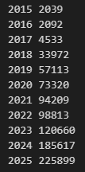
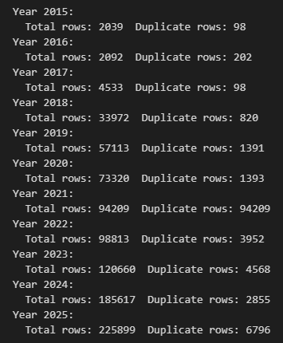
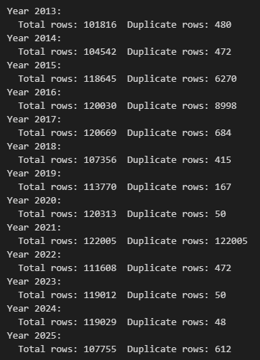
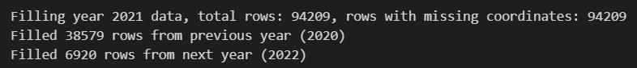
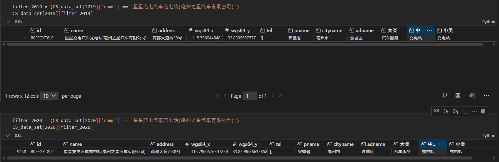
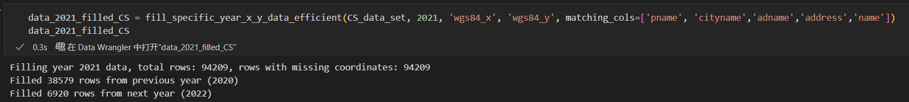

# Task

Charging and Gas Station Data Cleaning

1. Make a geospatial ID list, which contains ID, longitude, latitude, first year observed, and last year observed.
2. Aggregated data structure (columns)

| Year | Province | City | GS | CS | GCS | entry of GS | entry of CS | exit of GS | exit of CS | switch GS -> CS | switch CS -> GS | CS (added to existing GS) | GS (added to existing CS) |
| ---- | -------- | ---- | -- | -- | --- | ----------- | ----------- | ---------- | ---------- | --------------- | --------------- | ------------------------- | ------------------------- |

# Process

- How to build ID: baed on pname(province), cityname(city), adname(ad division), wgs84_x(longitude), wgs84_y(latitute)
- But if there is any problem with longitude and latitude ID?
- Longitude and latitude precision: 1e-6 (40,000km / 360 * 1e-6 = 0.11meter)
- If it is exactly same, must be the same CS or GS.
- But if it is not exactly same, there is small differece, what's the case(discussed later)

## Statistics

- charging station count for each year

- check:if there is any duplicate x and y; check if x and y are all in reasonable range(China's Longitude range:73.55-135.08, Latitude range:3.85-53.55)
- In most years, the duplicated data is acceptable(I checked the data, and they are same CS or GS)

- There is something wrong with 2021 data(there isn't wgs84_x and wgs84_y),try to use 2020 and 2022 data to fill
- use [pname, cityname, adname, address, name] to match but can only fill less than half

## Problem

1. 2021 data: all wgs84_x and wgs84_y are empty
2. even the same charging station, wgs84_x and wgs84_y in different year have slight difference(which means hard to set id, so exit, entry, switch, add are all hard to calculate)

3. if use [pname, cityname, adname, name, address] to merge, the merged ratio is much lower than expected(41%)

## Result

- seperate cs & gs count by city and year(cannot be merged because x and y problem)
-
